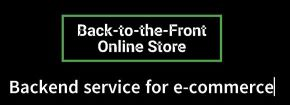

# Back-to-the-Front Online Store
  Backend Servide for E-Commerce
  [](https://opensource.org/licenses/MIT)
  ## Description
  This app provides a backend service for e-commerce websites. It allows the user to get, create, update, and delete data from the database of their online store.
  ## Table of Contents

  1. [Installation](#Installation)
  2. [Usage](#Usage)
  3. [License](#License)
  4. [Questions](#Questions)

  ## Installaion
  To install the app, visit the GitHub repot here: [Back-to-the-Front source code](https://github.com/Flem-House-Dev/Back-to-the-Front-Online-Store), and clone the repo into a folder on your local machine.

  Next, run the schema file to build the database. This can be done from the database management cli. Be sure that you are in the root directory of the project. Then, for Postgres the command to open the psql command line will be:
  ```
  psql -U postgres
  ```
  Please note that the default username is "postgres". If you have a different username, it will need to be changed.

  Next, from the postgres command line, run the following commands:

  ``` 
  \i db/schema.sql
  ```

  Then, you will enter `\q` to exit the psql command line.

  If you are using a database management system other than Postgres, consult its documentation on how to access its command line and run sql files.
  
  ## Usage
  Check out this helpful video walk-through to see the Back-to-the-Front app in action:</br>
  [](https://drive.google.com/file/d/1_7SlJeb26ERyXQxcwjV2r-jmVLoLcr73/view?usp=sharing)
  <!-- [Video Walk-through](https://drive.google.com/file/d/1wy3P8qBdW6BavywI5Zw3tZV2xZbCj6es/view?usp=sharing) -->

  In order to run the app, the you will need to enter your database login credentials in the `.env` file which is located in the root directory.
  </br>
  You will want to replace `"your_user_name"` and `"your_password"` with your actual username and password. And, if applicable you will need to replace `"localhost"` with the actual host.</br>

  To seed the database, run:
  ```
  npm run seed
  ```

  After the database is seeded, start the server by running:
  ```
  npm start
  ```

  To get a glimpse of the app's capabilities in action, we can use an api testing platform, such as Postman or Insomnia. In this demo, we will be using insomnia. 

  After setting up our requests with thier appropriate endpoints, we can see how the requests respond and the data that is being sent back from the database.
  
 
 
  

  ***

  ## License
  This software uses the MIT License.
  ## Questions
  To see more projects or to contribute, please visit my GitHub profile at: [Flem-House-Dev](https://github.com/Flem-House-Dev).
